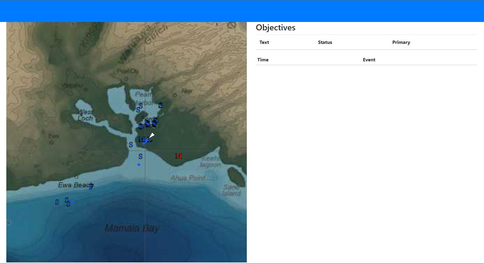

# Why?

I like the external map feature provided by the War Thunder game but I feel like it needs a little more polishing.

# Features

## Map

The map is pretty basic. It supports panning and zooming. It is using the char codes that come in the default utility for now because I don't want to include their assets in this solution. I'll make some custom icons soon so it's not just random letters.

See [#1](https://github.com/PatrickBig/Wingman/issues/1)